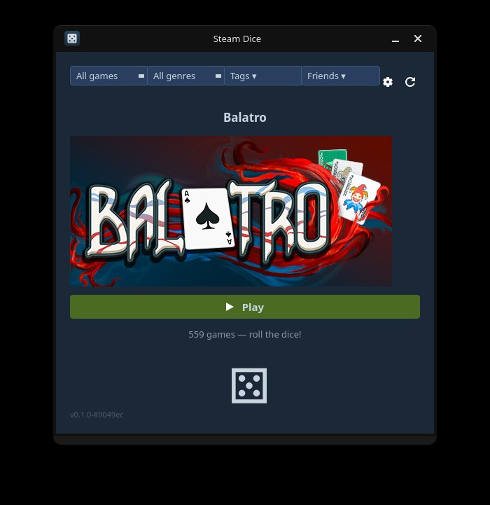

# Steam Dice

A small desktop app that picks a random game from your Steam library and lets you launch it directly. Stop staring at your backlog — let the dice decide.



## Features

- Rolls a random game from your Steam library and displays its header art
- Combinable filters in the top row, all AND'd together:
  - **Install state** — All / Installed / Not installed, to limit rolls to games you can actually play right now
  - **Genre** — official Steam genre (Action, Strategy, RPG, …)
  - **Tags** — multi-select popup with a search box; a game must carry every selected tag to survive
  - **Friends** — multi-select popup; picks games every selected friend also owns, perfect for "what should we play tonight?"
- **Play** button launches the selected game immediately via Steam
- **Store Page** button opens the rolled game's Steam store page in your browser — handy for checking screenshots, reviews, or gifting it to a friend
- **Optional store-price label** (off by default) shows the current store price under the title, with a configurable format (final only, with discount %, strikethrough original, or full strike + sale + %) — useful for spotting sales when picking a gift
- Settings dialog for your API key and Steam ID, persisted across sessions (API key kept in your system keyring)
- Refresh button with a 60-second cooldown to avoid hammering the Steam API; refreshing also re-fetches selected friends' libraries
- Clean Steam-themed dark UI built with PyQt6
- Wayland-native with X11 fallback

## Requirements

- Python 3.8+
- [PyQt6](https://pypi.org/project/PyQt6/)
- [requests](https://pypi.org/project/requests/)
- [keyring](https://pypi.org/project/keyring/) — used to store your Steam API key in the system keyring
- `xdg-utils` — used to launch games via `steam://` URLs
- Steam installed locally (for the "Installed" filter and launching games)

**Optional:** [python-steam](https://pypi.org/project/steam/) enables instant genre **and** tag filters by reading Steam's local `appinfo.vdf` cache. Without it, genres fall back to a rate-limited Steam Store API fetch and tag filtering is unavailable (no API fallback exists for tags).

Install with pip:

```bash
pip install PyQt6 requests keyring
# optional, for instant genre + tag filters
pip install steam
```

Or on Arch (mirrors what the [PKGBUILD](PKGBUILD) installs):

```bash
pacman -S python-pyqt6 python-requests python-keyring xdg-utils
# optional
pacman -S python-steam
```

## Setup

### 1. Steam API Key

You need a free Steam Web API key to fetch your library.

1. Go to [steamcommunity.com/dev/apikey](https://steamcommunity.com/dev/apikey) and log in with your Steam account.
2. In the **Domain Name** field, type any string and click **Register**.
3. Copy the 32-character key shown on the next page — paste it into Steam Dice's settings dialog.

> **Don't have a domain?** You don't need one. Steam's "Domain Name" field is **not validated** — `localhost`, your name, `personal`, or any other text works. It's just a label Steam stores alongside your key; it doesn't have to be a real domain you own.

If the page refuses to issue a key, the usual causes are:

- Your Steam account has spent **less than $5** lifetime on Steam (Valve's anti-spam threshold for API access).
- Your account is **limited** (new account with no purchases) or has an unverified email.
- You're signed into the wrong Steam account in your browser.

### 2. Steam ID (64-bit)

Your Steam ID is the 17-digit number in your profile URL:

```
steamcommunity.com/profiles/76561198000000000
                             ^^^^^^^^^^^^^^^^^
                             this is your ID
```

If you use a custom profile URL (e.g. `steamcommunity.com/id/yourname`), look up your numeric ID at [steamid.io](https://steamid.io).

## Usage

```bash
python steam_dice.py
```

On first launch the settings dialog will open automatically. Enter your API key and Steam ID, then click **Save**. Your library loads in the background.

Once loaded:

- Click the **dice** button to roll a random game
- Combine the four filter controls in the top row to narrow the pool:
  - **All games / Installed / Not installed**
  - **All genres** dropdown — pick one Steam genre
  - **Tags ▾** — opens a popup with a search box and checkboxes; selected tags are AND'd, so a game must carry every checked tag
  - **Friends ▾** — opens a popup listing your Steam friends; check any number to keep only games every selected friend also owns
- Click **Play** to launch the rolled game via Steam
- Click **Store Page** to open the rolled game's Steam store page in your browser
- Click ⟳ to re-fetch your library (60s cooldown applies); selected friends' libraries refresh too
- Click ⚙ to update your credentials, toggle the store-price label, or change its format

### Friends filter prerequisites

For a friend to appear and contribute to filtering, the **friend's** Steam profile privacy must allow:

- Friends list visibility (so you can see them in the popup at all)
- Game details visibility (so their owned-game list is fetchable)

Friends with private game details show as `(private / 0 games)` in the popup and never narrow the result.

## License

Steam Dice is free software released under the [GNU General Public License v2.0](LICENSE).
